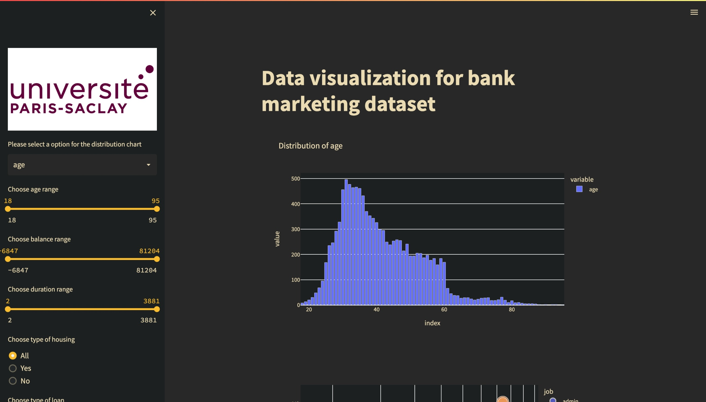

# Data Visualization project - UE03 Université Paris-Saclay
-------------



## How to use this repository

- Create the conda environment

```
conda env create -f environment.yml
```

- Activate the environment

```
conda activate plotly
```

- cd into the streamlit directory

```
cd streamlit
```

- Commence the streamlit project

```
streamlit run main.py
```