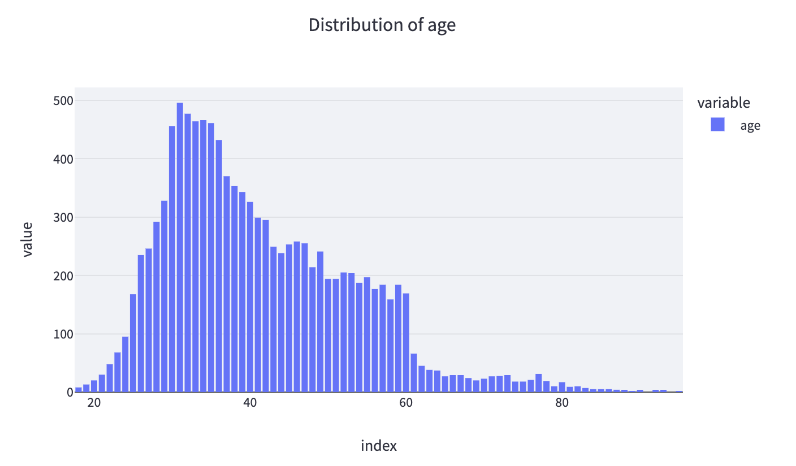
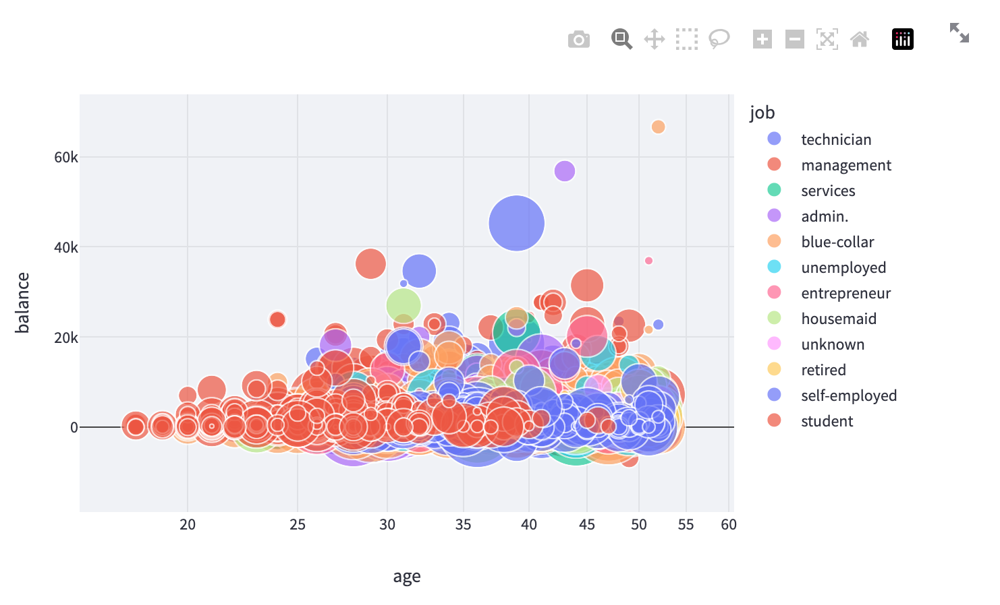
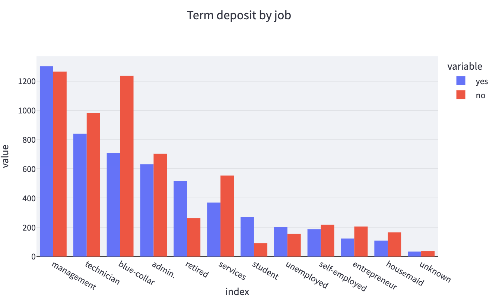
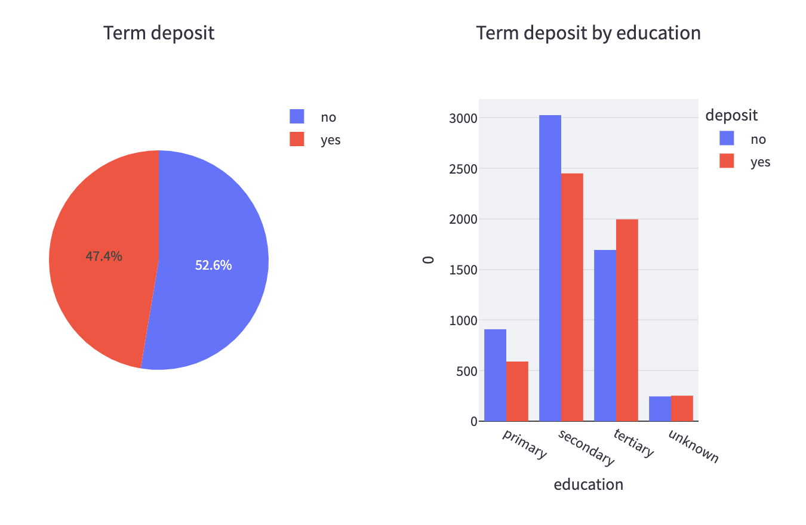
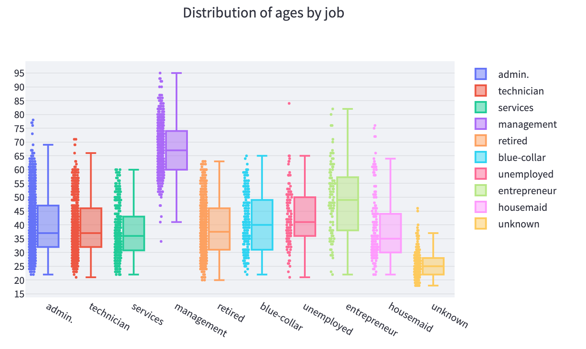

---
# pandoc report_eng.md -o pdf/report_eng.pdf --from markdown --template eisvogel.tex --listings --pdf-engine=xelatex --toc --number-sections

papersize: a4
lang: en-US
# geometry:
#     - top=30mm
#     - left=20mm
#     - right=20mm
#     - heightrounded
# mainfont: "Helvetica"
# sansfont: "Helvetica"
# monofont: "Helvetica"
documentclass: article
title: Data Visualization project - UE03

author: \textbf{LAI Khang Duy} \newline
        \newline
        \newline
        \textit{Université Paris-Saclay} \newline 
        \textit{UFR des Sciences d'Orsay}
footer-left: Université Paris-Saclay
date: 04-12-2022
titlepage: true
toc-own-page: true
# lof: true
# lof-own-page: true
titlepage-logo: ../images/logo-univ.png
header-includes: 
      - |
        ``` {=latex}
        \let\originAlParaGraph\paragraph
        \renewcommand{\paragraph}[1]{\originAlParaGraph{#1} \hfill}
        ```
...

# Introduction

This project will showcase some of the way to visualize a dataset with several type of chart, in order to show the user hidden information that hide under the dataset with more vibrant images.


<!-- images/screenshot_readme.jpeg -->

# State of the art

This project was written using Python. Here are the important libraries that I use to make it possible.

- Streamlit

Streamlit is an open-source app framework that turns charts and graphs from multiple libraries into a sharable web app. Streamlit support multiple type of graph, but in this project particularly, I will use Plotly to plot all the graphs that required.

- Plotly

Plotly is a library to draw graphs and charts. Normally it can work with dash but in this project I use Streamlit to display it instead

- Pandas

Pandas is a software library written for the Python programming language for data manipulation and analysis. In particular, it offers data structures and operations for manipulating numerical tables and time series.

# Information about the dataset in the project

1. Bank client data:

- age: (numeric)
- job: type of job (categorical: 'admin.','blue-collar','entrepreneur','housemaid','management','retired','self-employed','services','student','technician','unemployed','unknown')
- marital: marital status (categorical: 'divorced','married','single','unknown'; note: 'divorced' means divorced or widowed)
- education: (categorical: primary, secondary, tertiary and unknown)
- default: has credit in default? (categorical: 'no','yes','unknown')
- housing: has housing loan? (categorical: 'no','yes','unknown')
- loan: has personal loan? (categorical: 'no','yes','unknown')
- balance: Balance of the individual.

2. Related with the last contact of the current campaign:
- contact: contact communication type (categorical: 'cellular','telephone')
- month: last contact month of year (categorical: 'jan', 'feb', 'mar', ..., 'nov', 'dec')
- day: last contact day of the week (categorical: 'mon','tue','wed','thu','fri')
- duration: last contact duration, in seconds (numeric). Important note: this attribute highly affects the output target (e.g., if duration=0 then y='no'). Yet, the duration is not known before a call is performed. Also, after the end of the call y is obviously known. Thus, this input should only be included for benchmark purposes and should be discarded if the intention is to have a realistic predictive model.

3. Other attributes:
- campaign: number of contacts performed during this campaign and for this client (numeric, includes last contact)
- pdays: number of days that passed by after the client was last contacted from a previous campaign (numeric; 999 means client was not previously contacted)
- previous: number of contacts performed before this campaign and for this client (numeric)
- poutcome: outcome of the previous marketing campaign (categorical: 'failure','nonexistent','success')

Output variable (desired target):
- deposit - has the client subscribed a term deposit? (binary: 'yes','no')


# Project structure

## Controller sidebar


In this project, you can use the controller sidebar to manipulate the range of data that you want to show on the graphs. It contains 1 selectbox, 3 sliders and 2 radio button groups.

List of the column that you can change the range of the input data:

- age
- balance
- duration
- housing
- load

## Graphs


### Distribution chart



This chart show the distribution of the data that are in the dataset. You can choose from the selectbox which column you want to display to the user. It contains every columns that exist in the dataset but notice that only categorical data could be displayed properly.

Some of the interesting thing that you notice when you see the distribution of the data:

- The age range of the dataset with the highest number of people is bettween 30 and 37 years old
- Management, blue collar and technicien is the most job of the dataset.
- Married is the highest number of customer.
- Not many customer has loan


### Bubble chart

This chart show the relationship bettween 4 features of the dataset. We have some interesting insight that could be display while adjusting the slider in the sidebar.



- Most people have under 15k in their balance.
- Student in the bottom left.
- Retire in the bottom right.
- Managements usually have higher balance.

### Term deposit 

**By job**

The chart show the sucess of opening a term deposit over the job position. In the most case, the number of people did not open a term deposit greater than the people who did.



- The higher the duration, the more yes over no in term deposit.

-> duration marks a significant importance in these feature.

**By marital**

- Married person is the one who did not open a term deposit the most

**By education**

The chart show the sucess of opening a term deposit over the education feature.



- The younger the age, the more yes over no in term deposit.


### Distribution of age by job

- Managements usually have higher age than the other.

