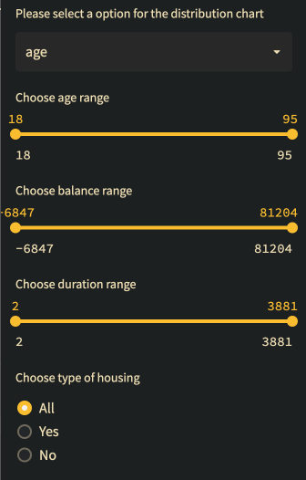

---
# pandoc report_eng.md -o pdf/report_eng.pdf --from markdown --template eisvogel.tex --listings --pdf-engine=xelatex --toc --number-sections

papersize: a4
lang: en-US
# geometry:
#     - top=30mm
#     - left=20mm
#     - right=20mm
#     - heightrounded
# mainfont: "Helvetica"
# sansfont: "Helvetica"
# monofont: "Helvetica"
documentclass: article
title: Data Visualization project - UE03

author: \textbf{LAI Khang Duy} \newline
        \newline
        \newline
        \textit{Université Paris-Saclay} \newline 
        \textit{UFR des Sciences d'Orsay}
footer-left: Université Paris-Saclay
date: 04-12-2022
titlepage: true
toc-own-page: true
# lof: true
# lof-own-page: true
titlepage-logo: ../images/logo-univ.png
header-includes: 
      - |
        ``` {=latex}
        \let\originAlParaGraph\paragraph
        \renewcommand{\paragraph}[1]{\originAlParaGraph{#1} \hfill}
        ```
...

# Introduction

This project will showcase some of the way to visualize a dataset with several type of chart, in order to show the user hidden information that hide under the dataset with more vibrant images.


<!-- images/screenshot_readme.jpeg -->

# State of the art

This project was written using Python. Here are the important libraries that I use to make it possible.

- Streamlit

Streamlit is an open-source app framework that turns charts and graphs from multiple libraries into a sharable web app. Streamlit support multiple type of graph, but in this project particularly, I will use Plotly to plot all the graphs that required.

- Plotly


- Pandas

# Information about the dataset in the project

dd


# Project structure

## Controller sidebar



## Graphs

d

### Distribution chart
- The age range of the dataset with the highest number of people is bettween 30 and 37 years old
- Management, blue collar and technicien is the most job of the dataset


### Bubble chart
- Most people have under 15k in their balance.
- Student in the bottom left.
- Retire in the bottom right
- Management usually in higher balance

### Term deposit by job

- The higher the duration, the more yes over no in term deposit
-> duration marks a significant importance in these feature

### Term deposit by education
- The younger the age, the more yes over no in term deposit.

### Purpose of low amount of balance 

